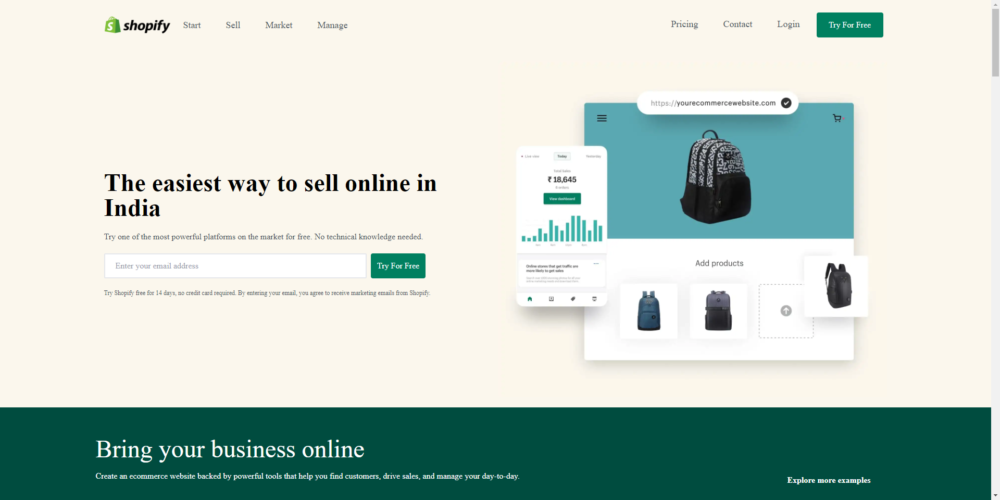

# HTML  , CSS  and Tailwind 

# Shopify Clone 

By Maulik Vadodariya

## [Link to the live Project](https://shopify-clone-tailwind-web.netlify.app/)

## What I learned from this Project?

- I have done this project using `HTML` , `CSS` and `Tailwind CSS`.
- In this project I came to know how Tailwind css is different from others framework.
- In this project I learned how to make responsive web design using Tailwind CSS.
- `Tailwind` responsive design and full end to end project.

## I spent 11 to 12 hours in making this project
